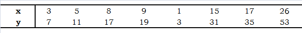
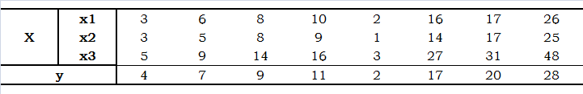
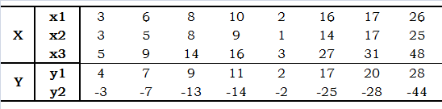

### 第3天：张量的自动求导机制


```python
import tensorflow as tf
tf.print('tensorflow的版本:{}'.format(tf.__version__))
```

    tensorflow的版本:2.1.0


### 1、自动求导机制
所谓的自动求导机制，就是对于属性为变量的张量，tensorflow会自动的将该变量加入到它的求导记录器tf.GradientTape()中，实现自动求导。对于属性为常量的张量而言，需要将该常量手工加入，涉及的函数就是**watch**，具体参见下面给出的示例。 

#### 1.1、一元函数求导

一元函数，也就是函数中变量的个数为1。引入一个例子，$y = 3x^{3} - 4x^{2} - 2x + 2$，计算函数$y$在$x=3$处的一阶导数$y1$，二阶导数$y2$的值。
因为$$\frac{\mathrm{dy}}{\mathrm{d}x} = 9x^{2} - 8x-2$$
$$\frac{\mathrm{d^{2}y}}{\mathrm{d}x^{2}} = 18x-8$$

所以$y1=9\times 3^{2} - 8\times 3-2=55，y2=18\times 3 - 8=28$


```python
# 注意类型必须均为浮点型，并且一致
# 常量
a = tf.constant(3.)
b = tf.constant(4.)
c = tf.constant(2.)
d = tf.constant(2,dtype=tf.float32)
# 变量
x = tf.Variable(3, dtype=tf.float32, name='x')

with tf.GradientTape() as g: # 自动求导机制
    y = a * tf.pow(x, 3) - b * tf.square(x) - c * x + d  # 函数
y1 = g.gradient(y, x) # 一阶导数
print('函数y在x=3处的一阶导数:y1=', y1.numpy(), sep='')

```

    函数y在x=3处的一阶导数:y1=55.0
    


```python
# 注意类型必须均为浮点性，并且一致
# 常量
a = tf.constant(3.)
b = tf.constant(4.)
c = tf.constant(2.)
d = tf.constant(2,dtype=tf.float32)
# 变量
x = tf.Variable(3, dtype=tf.float32, name='x')

with tf.GradientTape() as g: # 自动求导机制
    g.watch([a, b]) # 手动的将常量的a，b加入到求导的记录器中
    y = a * tf.pow(x, 3) - b * tf.square(x) - c * x + d  # 函数
y1_x, y1_a, y1_b = g.gradient(y, [x, a, b]) # 一阶导数

print('函数y在x=3处的关于a的一阶导数:y1_a=', y1_a.numpy(), sep='')
print('函数y在x=3处的关于b的一阶导数:y1_a=', y1_b.numpy(), sep='')
```

    函数y在x=3处的关于a的一阶导数:y1_a=27.0
    函数y在x=3处的关于b的一阶导数:y1_a=-9.0
    

在**tf.GradientTape()**下，只会保留计算一次的导数，因此如果需要多次调用**.gradient**，参数persistent需要设置为**True**，该值默认为**False**。


```python
# 注意类型必须均为浮点型，并且一致
x = tf.Variable(2, dtype=tf.float32, name='x')

with tf.GradientTape(persistent=True) as g:
    y = 3 * tf.pow(x, 3) - 4 * tf.square(x) - 2 * x + 2
    z = 4 * tf.pow(x, 3) - 2 * tf.square(x) + 3 * x - 1
y1 = g.gradient(y, x) 
z1 = g.gradient(z, x) 
print('函数y在x=2处的一阶导数:y1=', y1.numpy(), sep='')
print('函数z1在x=2处的一阶导数:z1=', z1.numpy(), sep='')
```

    函数y在x=2处的一阶导数:y1=18.0
    函数z1在x=2处的一阶导数:z1=43.0
    

计算函数的二阶导数，是利用嵌套来完成的，高阶亦如此。示例如下：


```python
# 注意类型必须均为浮点型，并且一致
x = tf.Variable(2, dtype=tf.float32, name='x')

with tf.GradientTape() as g2:
    with tf.GradientTape() as g1:
        y = 3 * tf.pow(x, 3) - 4 * tf.square(x) - 2 * x + 2
    y1 = g1.gradient(y, x) 
y2 = g2.gradient(y1, x) 
print('函数y在x=2处的二阶导数:y2=', y2.numpy(), sep='')
```

    函数y在x=2处的二阶导数:y2=28.0
    

#### 1.2 多元函数求导
多元就是函数中包含多个变量，下面引入一个例子：$$y = 6x_1^{2} - x_2^{2} + 4x_1x_2-5x_2$$
则函数$y$关于$x_1,x_2$的一阶导数分别为：
$$\frac{\mathrm{dy}}{\mathrm{d}x_1} = 12x_1 + 4x_2$$
$$\frac{\mathrm{dy}}{\mathrm{d}x_2} = -2x_2+4x_1-5$$


```python
# 注意类型必须均为浮点型，并且一致
# 变量
x1 = tf.Variable(3, dtype=tf.float32, name='x_1')
x2 = tf.Variable(1, dtype=tf.float32, name='x_2')

with tf.GradientTape() as g: # 自动求导机制
    y = 6 * tf.pow(x1, 2) - tf.pow(x2, 2) + 4 * x1 * x2 - 5 * x2 
dx1, dx2 = g.gradient(y, [x1, x2]) # 一阶导数
print('函数y在x_1=3, x_2=1处的关于x_1的一阶导数:dx1=', dx1.numpy(), ',关于x_2的一阶导数:dx2=', dx2.numpy(),sep='')
```

    函数y在x_1=3, x_2=1处的关于x_1的一阶导数:dx1=40.0,关于x_2的一阶导数:dx2=5.0
    

#### 1.3 向量求导
向量求导就是把向量作为变量，就是下面引入一个例子：$$Y=AX$$
其中$X$是一个2行一列的向量，$$A = \begin{bmatrix}
-3 & 6 \\ 
4 &  6 \\
5 &  7
\end{bmatrix}$$
则函数$Y$关于$X$的一阶导数为：
$$\frac{\partial Y}{\partial X} = \begin{bmatrix}
-3 & 4 &5 \\ 
6 &  6 &7\\
\end{bmatrix}$$


```python
# 注意类型必须均为浮点型，并且一致
# 变量
X = tf.Variable([[1], [1]], dtype=tf.float32, name='X')
A = tf.constant([[-3, 6],[4, 6], [5, 7]], dtype=tf.float32)
with tf.GradientTape(persistent=True) as g: # 
    Y = tf.matmul(A, X)
dX = g.jacobian(Y, X) # 一阶导数,注意此处不是梯度
print('函数y关于X的一阶导数:dX=', dX.numpy(),sep='')

gX = g.gradient(Y, X) # 一阶导数,注意此处不是梯度
print('函数y关于X的梯度:gX=', gX.numpy(),sep='') # 梯度的维度一定和变量的维度是一模一样的，这样才能利用梯度下降法更改参数
```

    函数y关于X的一阶导数:dX=[[[[-3.]
       [ 6.]]]
    
    
     [[[ 4.]
       [ 6.]]]
    
    
     [[[ 5.]
       [ 7.]]]]
    函数y关于X的梯度:gX=[[ 6.]
     [19.]]
    

#### 1.4 矩阵求导
矩阵求导就是把矩阵作为变量，这种情况在机器学习中经常出现。下面引入一个例子：$$Y= X^{T}AX$$
其中$X$是一个3行2列的矩阵,$$A = \begin{bmatrix}
-3 & 6 & 4\\ 
4 &  6  & 3\\
5 &  7 & 9
\end{bmatrix}$$


```python
# 注意类型必须均为浮点型，并且一致
# 变量
X = tf.Variable(tf.ones((3, 2)), dtype=tf.float32, name='X')
A = tf.constant([[-3, 6, 4],[4, 6, 3], [5, 7, 9]], dtype=tf.float32)
with tf.GradientTape(persistent=True) as g: # 
    Y = tf.matmul(tf.matmul(tf.transpose(X), A), X)
dX = g.jacobian(Y, X) # 一阶导数,注意此处不是梯度
print('函数y关于X的一阶导数:dX=', dX.numpy(),sep='')

gX = g.gradient(Y, X) # 一阶导数,注意此处不是梯度
print('函数y关于X的梯度:gX=', gX.numpy(),sep='') # 梯度的维度一定和变量的维度是一模一样的，这样才能利用梯度下降法更改参数
```

    函数y关于X的一阶导数:dX=[[[[13.  0.]
       [32.  0.]
       [37.  0.]]
    
      [[ 7.  6.]
       [13. 19.]
       [21. 16.]]]
    
    
     [[[ 6.  7.]
       [19. 13.]
       [16. 21.]]
    
      [[ 0. 13.]
       [ 0. 32.]
       [ 0. 37.]]]]
    函数y关于X的梯度:gX=[[26. 26.]
     [64. 64.]
     [74. 74.]]
    

### 2、结合优化器计算函数最小值

下面展示计算最小值的几种实现方式

 + **optimizer.apply_gradients**
 + **optimizer.apply_gradients+函数形式**
 + **autograph**
 + **autograph+函数形式**
 
下面给出计算函数最小值的示例：

首先引入一个示例：$y = 2x^{2} - 6x + 5$，计算函数的最小值。
因为$y = 2x^{2} - 6x + 5 = 2(x-1.5)^{2}+0.5$，所以当$x=1.5$时，$y$取得最小值$ymin = 0.5$


```python
# optimizer.apply_gradients
x = tf.Variable(2., name="x")
# 优化器，有很多优化器可供选择
# 优化器可以获得最小值的原理，就是变量x沿着梯度的相反的方向以learning_rate大小的步长变化，
# 也就是x=x-learning_rate*dy_dx,这样持续一定的步数，可以取得比较满意的最小值。
optimizer = tf.keras.optimizers.Adam(learning_rate=0.02)
for _ in range(1280):  # 持续1280步
    with tf.GradientTape() as tape:
        y = 2 * tf.square(x) - 6 * x + 5  # 需要获得最小值的函数
    dy_dx = tape.gradient(y, x) # 计算一阶导数
    optimizer.apply_gradients(grads_and_vars=[(dy_dx, x)])  # 应用一阶导数
print('最小值ymin={}'.format(y.numpy()), '此时x={}'.format(x.numpy()))
```

    最小值ymin=0.5 此时x=1.5
    


```python
# optimizer.apply_gradients+函数, 机器学习中比较常用的形式
x1 = tf.Variable(1.)
x2 = tf.Variable(1.)

#注意func()无参数
def func():    
    y = 2 * tf.square(x1) - 6 * x1 + 5 + tf.square(x2) + 4 * x2 - 8
    return y
# 优化器
optimizer = tf.keras.optimizers.Adam(learning_rate=0.02)   
for _ in range(1280):
    optimizer.minimize(func, [x1, x2]) # 最小值   
y = func()  # 此时x1，x2已经是使得y取得最小值的数值
print('最小值ymin={}'.format(y.numpy()), '此时x1={}'.format(x1.numpy()), '此时x2={}'.format(x2.numpy()))
```

    最小值ymin=-11.5 此时x1=1.5 此时x2=-1.999998927116394
    


```python
# autograph 动态计算图
x1 = tf.Variable(2.)
x2 = tf.Variable(2.)
optimizer = tf.keras.optimizers.Adam(learning_rate=0.08)

@tf.function
def targetfunc():
    for _ in tf.range(1280): # 使用tf.range(1280)
        with tf.GradientTape() as g:
            y = 2 * tf.square(x1) - 6 * x1 + 5 + tf.square(x2) + 4 * x2 - 8
        dy_dx = g.gradient(y, [x1, x2])
        optimizer.apply_gradients(grads_and_vars=zip(dy_dx, [x1, x2]))
        
    y =  2 * tf.square(x1) - 6 * x1 + 5 + tf.square(x2) + 4 * x2 - 8 # 根据得到的x值计算y的最小值
    return y
y = targetfunc()
print('最小值ymin={}'.format(y.numpy()), '此时x1={}'.format(x1.numpy()), '此时x2={}'.format(x2.numpy()))
```

    最小值ymin=-11.5 此时x1=1.5 此时x2=-2.000000476837158
    


```python
# autograph+函数形式
x = tf.Variable(0.2)
optimizer = tf.keras.optimizers.SGD(learning_rate=0.32)   

@tf.function
def func():   
    return 2 * tf.square(x) - 6 * x + 5

@tf.function
def train(epoch):  
    for _ in tf.range(epoch):  
        optimizer.minimize(func, [x])# 最小值
    return func()

y = train(1280)
print('最小值ymin={}'.format(y), '此时x={}'.format(x.numpy()))
```

    最小值ymin=0.5 此时x=1.5
    

### 3、线性回归示例

对于线性回归模型$$Y=WX+B$$
也就是计算使得最小二乘误差$$cost =\sum_{j=1}^{m} \sum_{i=1}^{n}(y_{ji}-\tilde{y}_{ji})^{2}$$
得到最小值的$W,B$。

其中$m$是一条数据中因变量的个数，$n$是数据条数，$y_{ji}$是$i$条数据的因变量$j$的值，$\tilde{y}_{ji}$是对应的模型输出值。
假设自变量矩阵的维度为$[d, n]$，也就是一条数据有$d$个自变量；因变量的维度为$[m, n]$。也就是一条数据有$m$个因变量，则$W$的维度就是$[m, d]$，$B$的维度就是$[m, 1]$。当d等于1时，$W$就可看作一个标量；当m等于1时，$B$也可以看成一个标量。

### 3.1 简单线性回归

简单线性回归就是只有一个自变量x，一个因变量y的模型，模型可以写成：
$$y=ax+b$$
下面给出一组数据：

计算出$a, b$的值。


```python
# 3.1 代码实现
x = tf.constant([3, 5, 8, 9, 1, 15, 17, 26], dtype=tf.float32)
y = tf.constant([7, 11, 17, 19, 3, 31, 35, 53], dtype=tf.float32)
a = tf.Variable(0.)
b = tf.Variable(0.)
# 优化器
optimizer = tf.keras.optimizers.Adam(learning_rate=0.6)
for _ in range(4001):  # 迭代的次数
    with tf.GradientTape() as t:
        y_modelout = a * x + b # 模型的输出值
        cost = tf.reduce_sum(tf.square(y - y_modelout))  # 定义最小二乘法误差
        if _ % 1000 == 0: # 打印误差
            print('误差：{}'.format(cost))
    d_cost = t.gradient(cost, [a, b]) # 计算一阶导数
    optimizer.apply_gradients(grads_and_vars=zip(d_cost, [a, b]))  # 应用一阶导数
    
print('最终最小二乘误差cost={}'.format(cost.numpy()), '此时模型参数a={},'.format(a.numpy()), 'b={}'.format(b.numpy())) 
print('模型输出值：{}'.format(y_modelout.numpy()))
```

    误差：5824.0
    误差：5.684341886080802e-14
    误差：5.684341886080802e-14
    误差：0.0
    误差：0.0
    最终最小二乘误差cost=0.0 此时模型参数a=2.0, b=1.0000001192092896
    模型输出值：[ 7. 11. 17. 19.  3. 31. 35. 53.]
    

### 3.2  多重线性回归

又称多因素线性回归，也就是有多个自变量，一个因变量y的模型，模型可以写成： 
$$y=AX+b$$

计算出$A, b$的值。

上面的数据中有8条数据，每条数据有3个自变量，所有自变量构成的数据矩阵就是3行8列的，因变量矩阵是1行8列的。所以参数矩阵A就是1行3列的，参数矩阵b就是一个标量。


```python
# 3.2 代码实现
x = tf.constant([[3, 6, 8, 10, 2, 16, 17, 26],[3, 5, 8, 9, 1, 14, 17, 26],[5, 9, 14, 16, 3, 27, 31, 48]], dtype=tf.float32)
y = tf.constant([4, 7, 9, 11, 2, 17, 20, 28], dtype=tf.float32)
A = tf.Variable(tf.zeros((1, 3)), dtype=tf.float32, name='A') # 1行3列
b = tf.Variable(0., name='b')

# 模型输出函数
def modelout():
    y_modelout = tf.matmul(A, x) + b
    return y_modelout
# 计算误差的函数    
def costfunc():    
    cost = tf.reduce_sum(tf.square(y - modelout())) 
    return cost
# 优化器
optimizer = tf.keras.optimizers.Adam(learning_rate=0.01)   
for _ in range(8001):
    optimizer.minimize(costfunc, [A, b]) # 最小值   
    if _ % 2000 == 0:
        print('误差：{}'.format(costfunc()))  # 误差的变化
        
cost, y_modelout = costfunc(), modelout()   
print('最小二乘误差cost={}'.format(cost.numpy()), '此时A={},'.format(A.numpy()), 'b={}'.format(b.numpy())) 
print('模型输出值：{}'.format(y_modelout.numpy()))
```

    误差：1625.72119140625
    误差：2.1829843521118164
    误差：1.9039669036865234
    误差：1.6688652038574219
    误差：1.6241304874420166
    最小二乘误差cost=1.6241304874420166 此时A=[[ 0.79583377  0.80701506 -0.28584385]], b=0.5898457169532776
    模型输出值：[[ 3.969173   6.8273287  9.410822  11.237818   2.1309967 16.903612
      18.977118  28.54341  ]]
    

### 3.3 多重多元线性回归

多元指的是有多个因变量的模型。多重多元线性回归的模型，可以写成：
$$Y=AX+B$$

计算出$A, B$的值。

上面的数据中有8条数据，每条数据有3个自变量，所有自变量构成的数据矩阵就是3行8列的；有2个因变量，因变量矩阵是2行8列的。所以参数矩阵A就是2行3列的，参数矩阵b就是2行一列的。


```python
# 3.3 代码实现
X = tf.constant([[3, 6, 8, 10, 2, 16, 17, 26],[3, 5, 8, 9, 1, 14, 17, 26],[5, 9, 14, 16, 3, 27, 31, 48]], dtype=tf.float32)
Y = tf.constant([[4, 7, 9, 11, 2, 17, 20, 28],[-3, -7, -13, -14, -2, -25, -28, -44]], dtype=tf.float32)
A = tf.Variable(tf.zeros((2, 3)), dtype=tf.float32, name='A')  # 2行3列
B = tf.Variable(tf.ones((2, 1)), dtype=tf.float32, name='B')  # 2行一列
# 优化器
optimizer = tf.keras.optimizers.SGD(learning_rate=0.000022)   

@tf.function  
def modelout():
    y_modelout = tf.add(tf.matmul(A, X), B)
    return y_modelout

@tf.function    
def costfunc():    
    cost = tf.reduce_sum(tf.square(Y - modelout())) 
    return cost

@tf.function
def train(epoch):  
    for _ in tf.range(epoch):  
        optimizer.minimize(costfunc, [A, B]) # 最小值
    return costfunc()

cost = train(20000)
y_modelout =  modelout()   
print('最终的最小二乘误差cost={}'.format(cost.numpy()), '此时A={},'.format(A.numpy()), 'B={}'.format(B.numpy())) 
print('模型输出值：{}'.format(y_modelout.numpy()))
```

    最终的最小二乘误差cost=3.6218783855438232 此时A=[[ 0.5145932   0.4480298   0.05619257]
     [-0.23077865  0.02671658 -0.8352975 ]], B=[[0.88975173]
     [1.2307721 ]]
    模型输出值：[[  4.0585837   6.723193    9.377432   10.967032    2.5355456  16.912859
       18.996311   28.615192 ]
     [ -3.5579019  -7.5379944 -12.09589   -14.201325   -1.709961  -24.640688
      -28.132507  -44.16912  ]]
    
